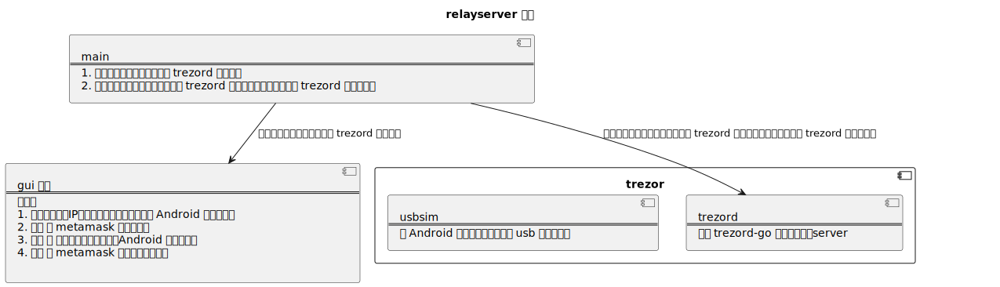
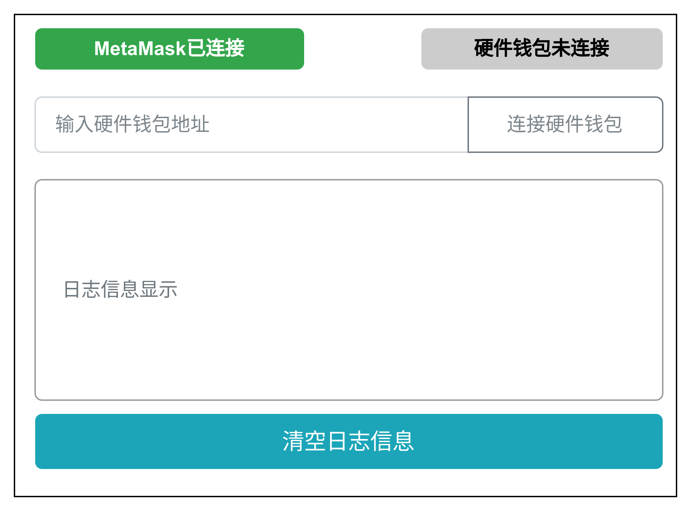

# 概述

relayserver 是这个项目的核心。
我借助于 trezor 的开源项目 [trezord-go](https://github.com/trezor/trezord-go) 来实现主体的 转发服务器。
并使用 Fyne 库做GUI界面。


# 架构



# 界面设计




# trezor server 部分

引入 trezord-go 项目，作为trezor server的实现。
```bash
go get github.com/trezor/trezord-go
```


